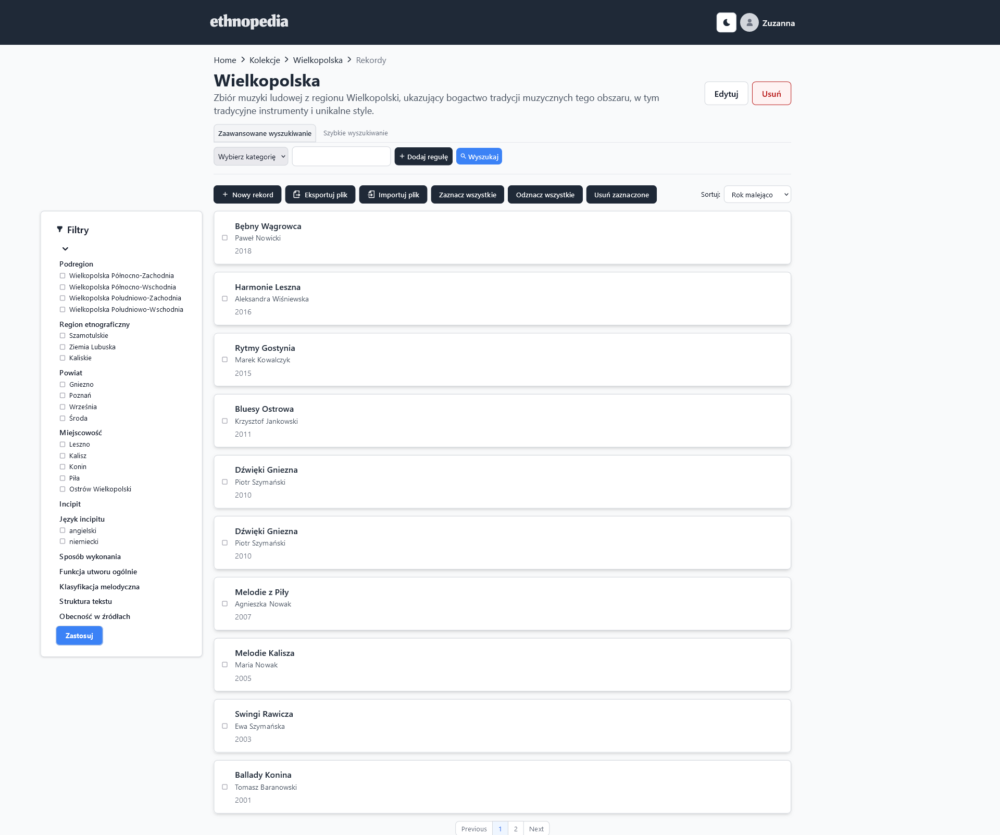
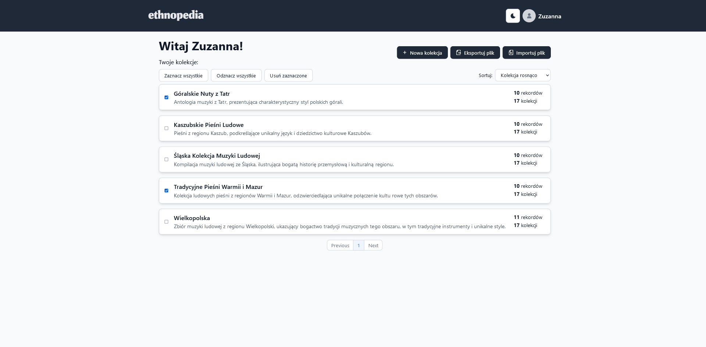
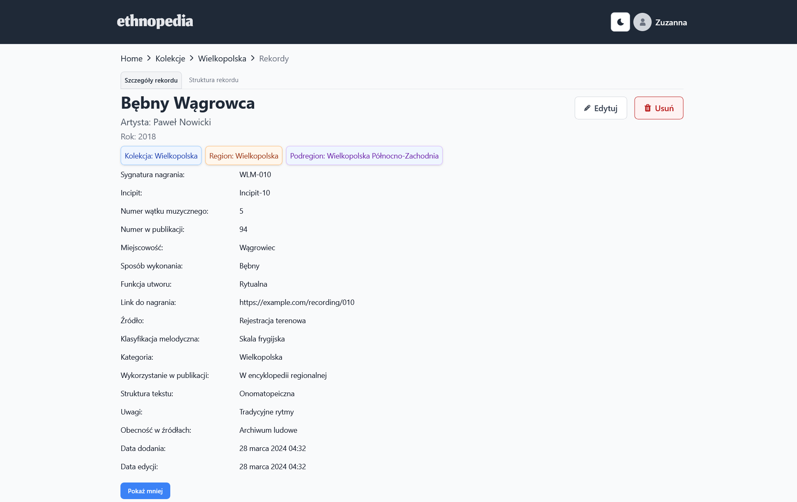
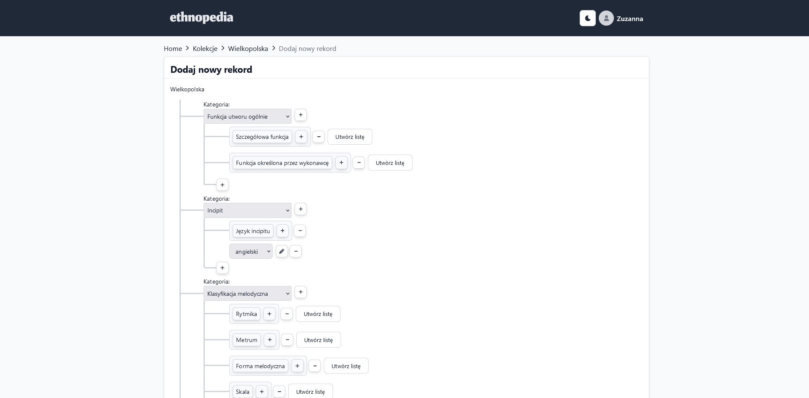
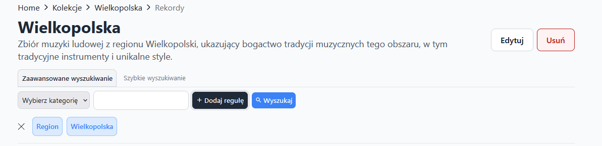

# Ethnopedia

Ethnopedia is a desktop and web application inspired by CollectiveAccess that allows users to edit the metadata of their files in a reconfigurable way.

It is specifically intended to be used by ethnomusicologists and music librarians working with folk music to edit the metadata of their files.
This tool will be developed in collaboration with the musicology expert, making sure it works well for folk music needs.


# Records view


# Main page


# Details


# Creating a record


# Advanced search


## Features

### User Account Management
- **Registering and Logging In**: Secure user account creation and login process.
- **Creating an Account**: Simple steps for setting up a new account.

***

### Artwork Metadata Management
- **Import/Export Metadata**: Effortlessly import and export artwork metadata from and to Excel files.
- **Artworks Metadata Editing**: 
  - **Creation**: Add new metadata entries for artworks.
  - **Updating**: Modify existing metadata entries.
  - **Deleting**: Remove unwanted metadata entries.
  - **Batch Deleting**: Remove multiple artworks simultaneously for efficient management.
- **Liking Artworks**: Engage with your favorite artworks by liking them.
- **Creating Collections**: Organize artwork metadata into collections for easy management.
- **Managing Collections**: 
  - **Updating Collections**: Modify the details of existing collections.
  - **Deleting Collections**: Remove collections as needed.

***

### Advanced Search Features
- **Advanced Searching**: Utilize comprehensive search options for detailed metadata queries.
- **Quick Searching**: Quick and efficient search tool for immediate results.

## Technology stack

The application is built using the following technologies:

-   [Electron](https://www.electronjs.org/)
-   [React](https://reactjs.org/)
-   [TypeScript](https://www.typescriptlang.org/)
-   [Tailwind CSS](https://tailwindcss.com/)
-   [Flowbite](https://flowbite.com/)


## Running the application

### Frontend
Before running the frontend, `cd frontend`

Make sure to set up your configuration. Create a `.env` file in the frontend directory with the following environment variables:
```
REACT_APP_API_URL=http://localhost:8080/api/
```

To run the application run the following command:

```
npm start
npm run dev:watch
```

To build the application for production, use the following command:

```
npm run build
```

### Backend 
1. Before running the backend, `cd backend`
2. Make sure to set up your configuration. Create a `.env` file in the backend directory with the following environment variables:

```
PORT=8000
MONGO_URI=
ACCESS_TOKEN_SECRET=
```
3. Install Dependencies:
```
npm install
```
4. Run the server:
```
npx nodemon
```
